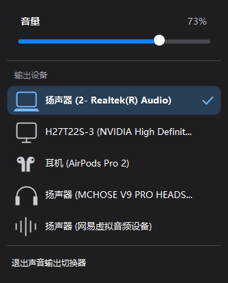

# 声音输出切换器

一款同时支持 Windows 与 macOS 的原生声音输出切换工具。用同一套快捷键逻辑快速预览设备，并在松开修饰键时应用选择。

| Windows | macOS |
| --- | --- |
| 按住 `Alt`，每按一次 `V` 预览下一个设备；松开 `Alt` 应用 | 按住 `Option`，每按一次 `V` 预览下一个设备；松开 `Option` 应用 |
| 圆角托盘菜单、音量滑块、设备图标 | 原生菜单栏菜单、音量滑块、设备图标 |
| Windows 10/11 x64 | macOS 13+，Apple Silicon |



## 下载

前往 [Releases](https://github.com/klske111/AudioOutputSwitcher/releases) 下载最新版本：

- Windows：`AudioOutputSwitcher-Windows-x64-*.zip`
- macOS：`AudioOutputSwitcher-macOS-arm64-*.zip`

Windows 解压后双击 `安装声音输出切换器.cmd`。macOS 解压后把应用拖入“应用程序”文件夹。

> 当前发布包采用本地/临时签名。Windows 可能显示 SmartScreen 提示；macOS 首次打开可能需要按住 `Control` 点按应用并选择“打开”。

## 功能

- 松开修饰键后才真正切换，按住期间可连续预览
- 托盘或菜单栏直接切换全部输出设备
- 音量滑块与实时百分比
- 根据笔记本扬声器、显示器、AirPods、头戴式耳机和虚拟音频设备显示不同图标
- 登录系统后自动启动
- 全部在本机运行，不依赖云服务

macOS 版另外包含 AirPods 路由保护，以及网易云音乐在路由变化后自动续播的兼容逻辑。

## 项目结构

```text
AudioOutputSwitcher/
├─ macos/                  # Swift / AppKit 原生版本
├─ windows/                # C# / WinForms 原生版本
├─ docs/images/            # README 截图
└─ .github/workflows/      # 双平台自动构建与发布
```

平台说明与本地构建方式：

- [Windows 版](windows/README.md)
- [macOS 版](macos/README.md)

## 隐私

应用只读取本机音频设备和音量状态，不包含遥测、广告或网络上传功能。macOS 的网易云自动续播功能会使用辅助功能权限，仅用于触发网易云音乐自身的播放菜单。

